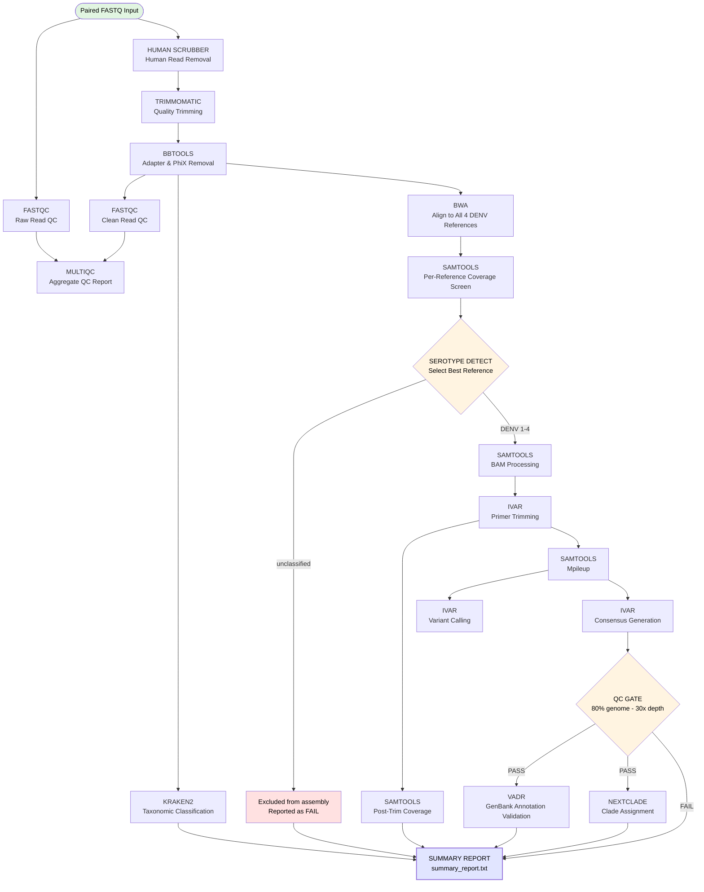

# Daytona Dengue

<p align="center">
  <em>⚠️ For research use only. Results were obtained by procedures that were not CLIA validated.</em>
</p>

<p align="center">
  
  
  
  
</p>

## 🦟🧬 Overview

Daytona Dengue is Florida BPHL's Nextflow pipeline for Dengue virus (DENV) NGS data analysis. It processes paired-end Illumina reads through human read removal, quality control, adapter trimming, reference-based assembly, variant calling, serotype clade assignment and GenBank submission validation.

Serotype detection (DENV1–4) is performed automatically via Kraken2 and coverage-based screening, and drives all downstream reference, primer and annotation selection. Nextclade provides fine-grained clade assignment using the [Hill et al. 2024 dengue lineage system (community/v-gen-lab datasets)](https://journals.plos.org/plosbiology/article?id=10.1371/journal.pbio.3002834). VADR validates consensus sequences for GenBank submission.

### ⚙️ Dependencies

- **Nextflow** 23.04–25.x - [installation guide](https://github.com/nextflow-io/nextflow)
- **Apptainer/Singularity** - [installation guide](https://apptainer.org/docs/user/latest/)
- **Conda** - [installation guide](https://docs.conda.io/projects/conda/en/latest/user-guide/install/index.html)
- **SLURM** workload manager (required for HiPerGator; otherwise not required)


All bioinformatics tools run inside containers, no additional software installation is required.

> ⚠️ **Nextflow ≥ 26.0 is not supported.** That release introduced breaking changes to DSL2 module parsing. Use Nextflow 23.04–25.x.

### 💻 Resource Requirements

Daytona Dengue is designed to run on an HPC environment but can run locally with sufficient resources.

- **CPUs:** 24 recommended; minimum 8
- **RAM:** 50 GB recommended; minimum 16 GB
- **Disk:** ~2–3 GB per sample (input + output)

**Estimated runtime** (18 samples, 24 CPUs, 100 GB RAM, HPC): ~26 minutes.

### 🛠️ Setup

#### 1. Create the conda environment

```bash
$ conda create -n daytona_dengue -c conda-forge python=3.10

```

#### 2. Configure params.yaml

Edit `params.yaml` and set the input and output paths for your run:

```yaml
input:  "/full/path/to/fastqs"
output: "/full/path/to/output"
```

Both `input` and `output` must be absolute paths with no trailing slash.

#### 3. Configure daytona_dengue.sh

> At Florida BPHL we use **Apptainer** on HiPerGator for containerization. `daytona_dengue.sh` is pre-configured for SLURM + Apptainer and is the recommended submission method for FL-BPHL users.

Set `NXF_APPTAINER_CACHEDIR` to your Apptainer image cache directory and add your email address for job notifications:

```bash
export NXF_APPTAINER_CACHEDIR=/path/to/apptainer/cache
#SBATCH --mail-user=your@email.gov
```

### How to Run

Place paired FASTQ files in the directory specified by `params.input`. Both Illumina native (`SAMPLE_S1_L001_R1_001.fastq.gz`) and simplified (`SAMPLE_1.fastq.gz`) naming conventions are supported.

### 🐊 HiPerGator Usage

```bash
sbatch daytona_dengue.sh
```

### ⚡ Local Usage

```bash
# Apptainer/Singularity
nextflow run daytona_dengue.nf -profile apptainer -params-file params.yaml

# Docker
nextflow run daytona_dengue.nf -profile docker -params-file params.yaml
```

### Workflow Diagram



### 🧩 Modules

Daytona Dengue is made possible thanks to the following tools:

<small>

**Quality Control**: [FastQC](https://github.com/s-andrews/FastQC) 0.12.1 · [Trimmomatic](https://github.com/usadellab/Trimmomatic) 0.40 · [BBTools](https://github.com/bbushnell/BBTools) 39.84 · [MultiQC](https://github.com/MultiQC/MultiQC) 1.34

**Human Read Removal**: [NCBI SRA Human Scrubber](https://github.com/ncbi/sra-human-scrubber) 2.2.1

**Taxonomic Classification**: [Kraken2](https://github.com/DerrickWood/kraken2) 2.17.1

**Reference-Based Assembly**: [BWA](https://github.com/lh3/bwa) 0.7.19 · [Samtools](https://github.com/samtools/samtools) 1.23.1 · [iVar](https://github.com/andersen-lab/ivar) 1.4.4

**Clade Assignment**: [Nextclade](https://github.com/nextstrain/nextclade) 3.21.2 · [v-gen-lab dengue datasets](https://github.com/nextstrain/nextclade_data/tree/master/data/community/v-gen-lab/dengue) (Hill et al. 2024)

**Submission Validation**: [VADR](https://github.com/ncbi/vadr) 1.7

</small>

### 📁 Output

Per-sample results are written to `params.output/<sample_id>/`. A single summary file is written to `params.output/`:

```
output/
├── <sample_id>/
│   ├── fastqc/
│   ├── trimmomatic/
│   ├── bbtools/
│   ├── bwa/
│   ├── samtools/
│   ├── ivar/
│   ├── vadr/
│   └── nextclade/
├── multiqc/
└── summary_report.txt
```

| File | Samples | Key fields |
|------|---------|------------|
| `summary_report.txt` | All (including unclassified) | sample_id · serotype · nextclade_clade · kraken2_percent · reference · coverage stats · assembly stats · VADR_flag · QC_flag |

### 📁 Directory Structure

```text
daytona_dengue/
├── daytona_dengue.nf       # Entry workflow
├── daytona_dengue.sh       # SLURM submission script
├── nextflow.config         # Container, resource, and profile configuration
├── params.yaml             # Runtime parameters (input/output paths)
├── modules/                # One .nf file per tool or tool group
├── bin/                    # Python helper scripts (QC gate, summary report)
└── assets/
    ├── reference/          # Reference FASTA + BWA indexes (DENV1–4)
    ├── primers/            # Primer BED files (DENV1–4)
    ├── annotations/        # Per-serotype GFF files (for iVar variants)
    ├── nextclade/          # Cached Nextclade datasets (auto-downloaded)
    └── vadr/               # Cached VADR models (auto-downloaded)
```

### 🤝 Contributing

We welcome contributions to make Daytona Dengue better! Feel free to open issues or submit pull requests to suggest additional features or enhancements.

### 📧 Contact

**Email**: [bphl-sebioinformatics@flhealth.gov](mailto:bphl-sebioinformatics@flhealth.gov)

### ⚖️ License

Daytona Dengue is licensed under the [MIT License](LICENSE).
